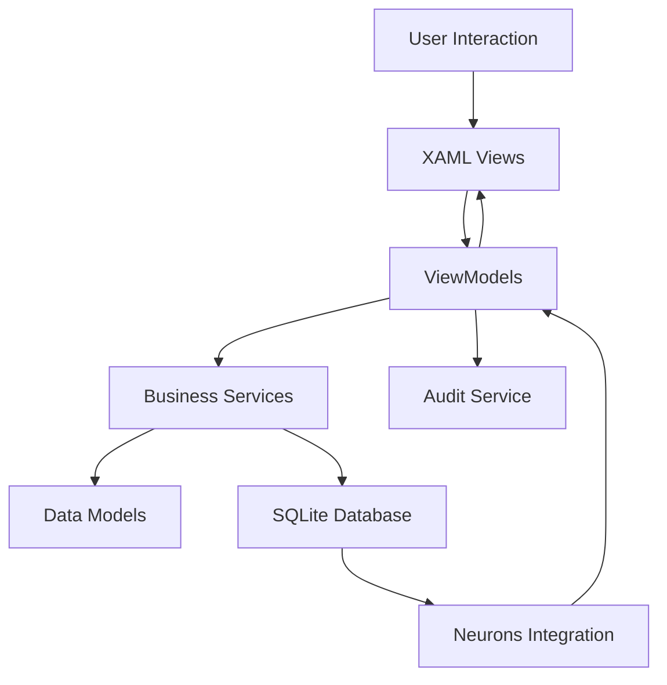

# OPERATION PRIME Architecture Guide

## Table of Contents
1. [Four Core Layers](#four-core-layers)
2. [Dependency Injection & Service Registration](#dependency-injection--service-registration)
3. [Configuration & Options Pattern](#configuration--options-pattern)
4. [Testing & Architecture Validation](#testing--architecture-validation)
5. [Logging & Error Handling](#logging--error-handling)
6. [Web Request Wrapper Service](#web-request-wrapper-service)
7. [Validation & DTOs](#validation--dtos)
8. [Data Flow Architecture](#data-flow-architecture)
9. [Core Components](#core-components)
10. [Security Architecture](#security-architecture)
11. [Performance Considerations](#performance-considerations)
12. [Development Principles](#development-principles)
13. [Deployment Architecture](#deployment-architecture)

---

## Four Core Layers

OPERATION PRIME strictly follows the Clean Architecture pattern to maximize maintainability, testability, and future-proofing:

- **Domain Layer**: Pure C# models, domain entities, value objects, business rules (e.g. priority matrix, audit trail). No dependencies on EF Core, UI, or infrastructure.
- **Application Layer**: Use-cases, workflow logic (e.g. NOI builder), DTOs, repository/service interfaces. Coordinates business logic and defines contracts for infrastructure.
- **Infrastructure/Data Layer**: EF Core DbContext, SQLCipher encryption, repository/service implementations, data migrations, external integrations.
- **Presentation Layer**: WinUI 3 UI, ViewModels, XAML, Services, Utils. No direct dependency on infrastructure or data access.

**Dependency Rule:** Dependencies always flow inward—higher layers depend on abstractions from lower layers, never the reverse. This isolates business logic from UI, persistence, and external APIs.

### Granular Folder Structure
Use clear subfolders to enforce boundaries and readability:

```
Domain/
├── Entities
├── ValueObjects
├── DomainEvents
├── Interfaces       (e.g. IIncidentRepository, ITokenProvider)
└── Exceptions

Application/
├── Services         (use cases)
├── DTOs
├── Validators       (FluentValidation)
└── Mappers or Contracts

Infrastructure/
├── Data/
│   ├── Context      (DbContext + SQLCipher setup)
│   ├── Configurations
│   ├── Migrations
│   └── Repositories
└── Services         (HTTP token wrapper, external services)

Presentation/
├── ViewModels/
│   └── BaseViewModel.cs
├── Views/
└── Utils/
```

## Dependency Injection & Service Registration

- Use `Microsoft.Extensions.DependencyInjection` for all service registration.
- Register all repositories, services, and ViewModels with appropriate lifetimes:
  - `DbContext`: Scoped or Transient (never Singleton)
  - Services: Singleton (if stateless/shared), Scoped/Transient as needed
  - ViewModels: Scoped/Transient for navigation/page-specific, Singleton only for global state
- All interfaces are defined in Domain/Application; implementations are wired up in Infrastructure at startup.
- Always code to interfaces to enable easy swapping and testing.

## Configuration & Options Pattern

Initialize application settings via `appsettings.json`:

- Database encryption key and connection
- Token endpoint URLs, web request settings

Use `IOptions<T>` in constructors to consume configuration—avoids hard-coded values and supports multiple environments.

## Testing & Architecture Validation

Include `tests/` folder at solution root:

```
tests/
├── Domain.Tests/
└── Application.Tests/
```

- **Domain.Tests** for business logic like priority matrix and NOI builder
- **Application.Tests** for workflow validation and interface mocking

Add architecture tests using **NetArchTest** to ensure domain does not reference infrastructure or presentation layers.

## Logging & Error Handling

- Inject `ILogger<T>` into all services, repositories, and ViewModels.
- Scaffold `IAuditService` and domain-level error handling from the start.
- Persist incident changes and user actions from the beginning (even if storage is basic at first).
- Convert low-level exceptions into meaningful, domain-level errors.

## Web Request Wrapper Service

Instead of scattering web requests across layers:

- Create `ITokenProviderService` interface (in Application or Domain layer)
- Implement `TokenProviderService` in Infrastructure:
  - Wraps `Invoke‑WebRequest`, fetches and optionally caches tokens
  - Provides `GetIncidentDataAsync(token)` or equivalent

This isolates external logic and supports mocking for tests and future replacement.

## Validation & DTOs

### Validation Strategy
- **Current**: Use ObservableValidator and data annotations for simple form validation
- **Future**: Migrate to FluentValidation in Application layer as incident workflows become more complex (PreIncident vs MajorIncident with different rules, cross-field validation, conditional logic)

### DTOs for Structured Workflows
- Use DTOs (Data Transfer Objects) from the Application layer to communicate with the Presentation layer
- This prevents UI logic from leaking into the domain, keeps the domain model pure, and allows for flexible UI changes without impacting core logic
- Essential for complex workflows like NOI previews, priority calculations, and document generation

## Data Flow Architecture



## Core Components

### 1. Data Layer
- **SQLite Database**: Local storage with WAL mode for concurrency
- **Entity Framework Core**: ORM for data access
- **SQLCipher**: AES-256 encryption for data at rest
- **Models**: Shared base class for Pre/Major incidents with type-specific extensions

### 2. Business Logic Layer
- **PriorityService**: Centralized priority calculation using urgency × impacted users matrix
- **NOIService**: Notice of Incident generation using builder pattern
- **AuditService**: Change tracking and compliance logging
- **NeuronsService**: External Neurons integration with offline fallback

### 3. Presentation Layer
- **WinUI 3**: Modern Windows UI framework
- **MVVM Toolkit**: CommunityToolkit.Mvvm v8.4+ for property binding, validation, messaging, and command support
- **Commands**: Use `[RelayCommand]` and `IAsyncRelayCommand` for actions in ViewModels
- **Messaging**: Employ `IMessenger` for decoupled ViewModel-to-ViewModel communication
- **ContentDialog**: Modal wizards for incident creation
- **NavigationView**: Main application navigation

### 4. Integration Layer
- **HttpClient**: HTTP requests for Neurons integration
- **Message Bus**: Inter-component communication using MVVM messaging

## Security Architecture

### Data Protection
- **Encryption at Rest**: SQLCipher with AES-256
- **Secure Configuration**: Environment variables for sensitive data
- **Input Validation**: Comprehensive sanitization using data annotations
- **Audit Trail**: Complete action logging for compliance

### Network Security
- **Timeout Handling**: Graceful degradation when offline

## Performance Considerations

### Database Optimization
- **Indexed Queries**: Strategic indexing for incident searches
- **Connection Pooling**: Efficient database connection management
- **Lazy Loading**: On-demand data retrieval for large datasets

### UI Responsiveness
- **Async Operations**: Non-blocking database and network calls
- **Virtual Scrolling**: Efficient rendering of large incident lists
- **Background Processing**: Heavy operations moved off UI thread
- **Throttled Updates**: Prevented cascading events

## Development Principles

> **📋 See [Coding Standards](./CODING_STANDARDS.md) for detailed implementation guidelines**

### Code Organization
- **Separation of Concerns**: Clear layer boundaries
- **Single Responsibility**: Each class has one purpose
- **Dependency Injection**: Loose coupling between components
- **Minimal Dependencies**: Only essential NuGet packages
- **SOLID Principles**: Follow all five principles for maintainable code
- **Modern MVVM Pattern**: All ViewModels must inherit from `BaseViewModel : ObservableValidator` and use `[ObservableProperty]` partials for observable properties. Validation is handled via data annotations and toolkit support.
- **C# Preview Features**: The `.csproj` must set `<LangVersion>preview</LangVersion>` to enable partial property support and future-proofing.
- **Toolkit Analyzer Enforcement**: MVVM Toolkit analyzers must be enabled to surface usage errors and warnings.

### Testing Strategy
- **Unit Tests**: xUnit for business logic validation
- **Integration Tests**: End-to-end workflow testing
- **Performance Tests**: Load testing with large datasets
- **Security Tests**: OWASP ZAP for vulnerability scanning

## Deployment Architecture

### Application Packaging
- **MSIX/MSI**: Windows installer with code signing
- **Self-Contained**: No external runtime dependencies
- **Auto-Update**: Built-in update mechanism
- **Configuration**: Environment-specific settings

### System Requirements
- **OS**: Windows 10/11
- **Runtime**: .NET 9 (bundled)
- **Database**: SQLite (embedded)

---

This architecture ensures OPERATION PRIME is secure, performant, and maintainable while meeting enterprise requirements for incident management.